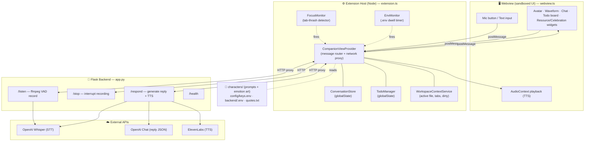
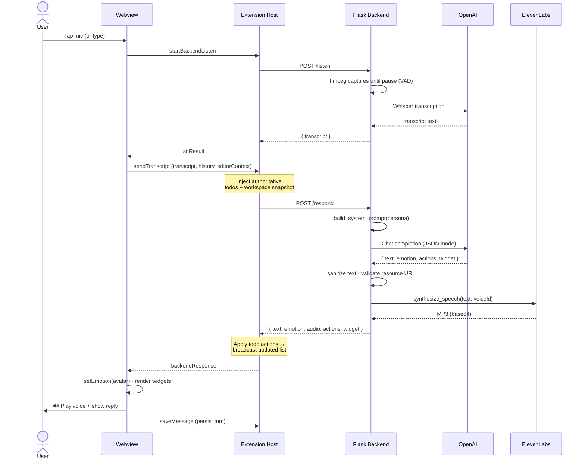
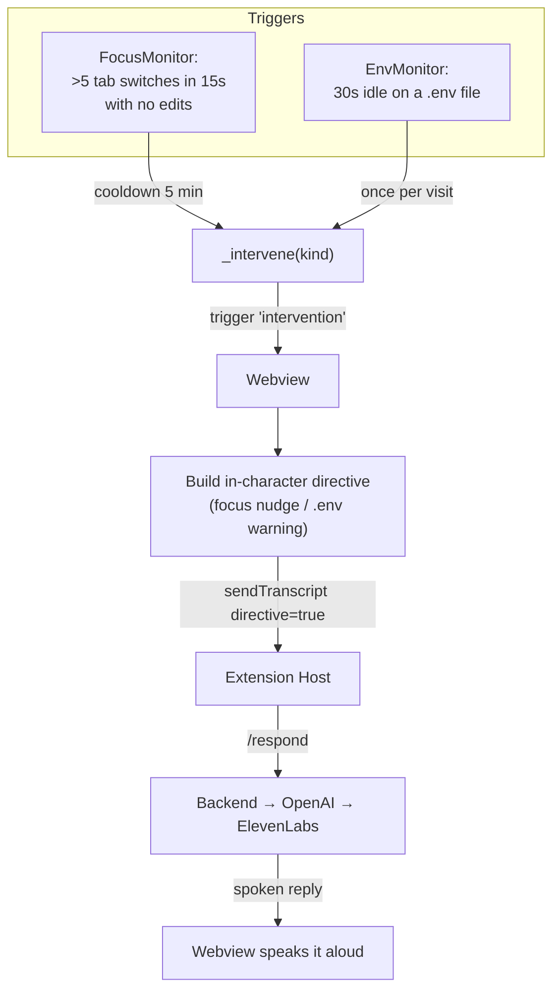

# MOMMY ASMR — Workflow & Architecture

A voice-to-voice AI coding companion. There are three runtime pieces:

1. **Webview** (browser sandbox) — the UI: avatar, waveform, chat, todo board, widgets, audio playback.
2. **Extension Host** (Node) — owns VS Code state, proxies network calls (avoids webview CORS), tracks todos/workspace/focus/.env.
3. **Flask Backend** (Python) — records the mic, transcribes (Whisper), generates the reply (OpenAI), and synthesizes voice (ElevenLabs).

---

## 1. Component / Architecture Map

---

## 2. Voice Conversation Flow (a single turn)

---

## 3. Proactive Interventions (the companion speaks unprompted)

Two background monitors in the extension host nudge the user in-character without any mic input.

---

## Key design notes

- **Why proxy through the host?** The webview CSP sets `connect-src 'none'` — it can't make network calls. The extension host owns all HTTP to Flask, and is also the source of truth for todos and workspace state, which it injects into every `/respond`.
- **Two mic paths:** the primary path records on the **backend** via ffmpeg (`/listen`), sidestepping the unreliable webview `getUserMedia` permission layer. Raw audio can also be sent to `/respond` as a fallback.
- **Structured replies:** the model must return a single JSON object (`text`, `emotion`, optional `actions`, `widget`). Text is sanitized for TTS (no emojis/markdown/URLs) and resource-widget URLs are liveness-checked with a Google-search fallback.
- **Personas** live in `characters/<id>/` (a `prompt.txt` + emotion art); voice IDs and API keys come from `config/keys.env` / `backend/.env`.
